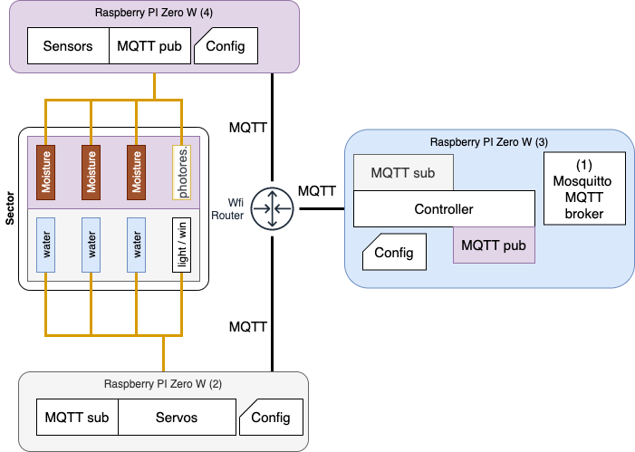

# Pollicino

<hr />

*"Done is better than perfect!"* and *"Premature optimization is the root of all evil"* are two of the guidelines I am following for my new Christmas project. As almost every year I commit myself to start and hopeful to complete a project and this time I focused on domotic and gardening.

The goal of the project is indeed to provide a way to ***automatize plants  and garden caring*** and probably more.

It is full of projects on internet about this and I do took a lot of inspiration from them but I added some some personalization to enable scalability, customization and plug and play approach.

Here some of the component and tools used to give you an idea of what you will find here:

- Raspberry PI Zero W
- Sensors (Moisture, Brightness,...)
- Solenoid valve, servo motor
- MQTT (Mosquitto, MQTT Explorer)
- Ansible
- Docker
- Python
- ...

<hr/>

### Table of Contents

1. [How to ...](#howto)
	- [Simulation](#sim)
	- [First run](#first)
2. [Software and flow](#software) (Almost finished)
3. [Hardware](#hardware) (Just started)
4. [Up and running](#all) (To do)
5. [Contributing](#contributing)
6. [References](#references)
7. [Next Step](#next)

<hr/>
# How to <a name="howto"></a>


## Prerequisites <a name="pre"></a>
Ensure you have installed

- [Ansible](https://docs.ansible.com/ansible/latest/installation_guide/intro_installation.html)
- [MQTT Explorer](http://mqtt-explorer.com/)
- [Docker](https://docs.docker.com/get-docker/)
- [Git](https://git-scm.com/book/en/v2/Getting-Started-Installing-Git)

# Run simulation <a name="sim"></a>

1) Start machines on docker

On **Terminal 1**

```bash
git clone git@github/enzomar/pollicino
cd pollicino/emu
docker-compose up
```

2) Configure manchines and start

On **Terminal 2**

```bash
cd pollicino/ansible
ansible-playbook setup.yaml -i hosts_emu
ansible-playbook start.yaml -i hosts_emu
```


3) Open MQTT Explorer and create a new connection ( host = localhost, port = 1883)

On **MQQT Explorer**


4)  Connect to the broker and explore


5) Close 

On **Terminal 1**

```shell
CTRL+c
```

## Setup and first execution <a name="first"></a>


### Configure a new raspberry pi 
1. Connect the rapberry pi to the same network (wifi) of Pollicino
2. Update the new raspberry pi hostname to <new-hostname> choosen by you
 ```
./init_rpi.sh <rpi_ip> <new-hostname>
```
3. Create a new config file at ```config/<new-hostname>.yaml``` and populate it with the sensor configuration
4. Update the host by adding under the rigth group ( or add a new one in case) the <new-hostname>
5. Restart 
```
cd pollicino/ansible;
ansible-playbook refresh.yaml -i hosts_emu
```

### Configure a new sensor 

Steps to configure a new sensor to an exising raspberry pi already part of the pollicino platform 

1. Update the config file 
```
config/<existing>.yaml
```
2. Restart 
```
cd pollicino/ansible;
ansible-playbook refresh.yaml -i hosts_emu
```


# Software <a name="software"></a>

## Flow


- The **sensor** it is in charge to observe regularly the phisical environment and publish state and measurement
- The **controller** goal is to read the input from the sensors and, after applying a certain logic, it will eventually send commands to the servo to change the state of the environment. It is also possible to *schedule* commands.
- The objective of the **servo** is to execute the command sent by the controller by activating an engine, solenoid valve or any other phisical device. Can be triggered as:
    - *Switch*: it is basic binary on / off cmmands (ie. swithcing on/off a light)
    - *Square*: It will maitain a certain state for a given time (ie. open water for a given amount of time) and then go back to the initial state, whatever it was
    - *Pulse*: it will change state multiple times over time 

- The **broker** role is to provide a scalable and realilable message bus used by above components to communicate.


## Components



### Message bus and broker
The protocol choosed to make the components exchanging messages is [MQTT](https://mqtt.org/). It can be considered the standard in the IoT communication.   
MQTT is a pub/sub protocol and its main elementis the topic to be published by a producer and subscribed by consumer. I strongly suggest you to have a look to this [link](https://www.hivemq.com/blog/mqtt-essentials-part-5-mqtt-topics-best-practices/) , it explains quite well how to perform the first step into the deisgn part of MQTT Topic.
### Topic
Defining the topic grammar is crucial in order to be able to govern the message exchange in a clear way. Here below the topic's pattern designed:
    
    PATTERN_STATUS = '{sector}/{category}/{type}/{dev_id}'
    PATTERN_CMD_PUB = '{sector}/{category}/{type}/{dev_id}/set'
    PATTERN_CMD_SUB = '{sector}/{category}/+/+/set'

- The *sensor* will **publish** PATTERN_STATUS
- The *controller* will **suscribe** to PATTERN_STATUS
- The *controller* will **publish** to PATTERN\_CMD_PUB
- The *servo* will **suscribe** to PATTERN\_CMD_SUB

Note that all sensors and servos (*category*) operate in a certain *sector* and they are identifed by a *type* and an *id*


### Sensor
The sensors needs to transmit at regular time status of a given device. It is possible to set **polling_in\_second** 

### Controller

### Servos

## Project Organization

```shell
├── ansible                    <--- tasks automation 
├── docs
├── emu                        <--- used for emulation purpose only ( Docker)
│   ├── Dockerfile
│   ├── docker-compose.yaml
├── pollicino                  <--- source code
│   ├── __pycache__
│   ├── broker
│   ├── controller
│   ├── helpers
│   ├── sensors
│   ├── servos
│   └── __init__.py
├── broker.sh                  <--- scripts to easy the start/stop/state opearation of each component
├── controller.sh
├── daemon_broker.sh
├── pollicino.py               <--- main
├── pollicino.yaml             <--- configuration (topology , gpio...)
├── requirements.txt
├── sensors.sh
├── servos.sh
├── setup.sh
├── start_all.sh
├── state.sh
└── stop.sh
```

# Emulation
I decide to test all the entire application before finalizing the hardware connestion and soldering. The idea is to use:
 
- docker to run a basic unix image, emulating the rraspberry Pi OS
- ansible to perform the setup and execution


# Hardware <a name="hardware"></a>

- 3 Raspberry PI Zero W
- Raspberry Pi Relay Hat 5V
- Soil Moisture sensors (resistive) + ADC
- 2 FPD-270A solenoid valve 12V
- Router TP link TL-MR3020
- NP7-12 FR 1v Volte BAttery

## Raspberry PI Zero W

### GPIO


GPIO (General-purpose input/output) are hardware pins rows which locate in the top of RPi board. Raspberry Pi use  GPIO pins to interact with other hardware including sensors, motors, and many many other peripheral devices.


There are two MODE to select the pin on the GPIO

- BOARD: This type of pin numbering refers 
to the number of the pin in the plug, 
i.e, the numbers printed on the board, 
for example, P1. The advantage of this type 
of numbering is, it will not change even though 
the version of board changes.

- BCM: The BCM option refers to the pin 
by “Broadcom SOC Channel. They signify the 
Broadcom SOC channel designation. The BCM 
channel changes as the version number changes. 

In the project the **BOARD** mode is used, even if it is possible to selecte the BCM one

If you want to see the schema and stus of the pin on your raspberry PI wou can use the following metods:

```bash
gpio readall
```


```bash
pinout
```


## Moisture Sensors

## Electro

# Network

# Up and running <a name="all"></a>


# Contributing <a name="contributing"></a>

When contributing to this repository, please first discuss the change you wish to make via issue,
email, or any other method with the owners of this repository before making a change. 

Please note we have a code of conduct, please follow it in all your interactions with the project.

## Pull Request Process

1. Ensure any install or build dependencies are removed before the end of the layer when doing a 
   build.
2. Update the README.md with details of changes to the interface, this includes new environment 
   variables, exposed ports, useful file locations and container parameters.
3. Increase the version numbers in any examples files and the README.md to the new version that this
   Pull Request would represent. The versioning scheme we use is [SemVer](http://semver.org/).
4. You may merge the Pull Request in once you have the sign-off of two other developers, or if you 
   do not have permission to do that, you may request the second reviewer to merge it for you.

## Code of Conduct

### Our Pledge

In the interest of fostering an open and welcoming environment, we as
contributors and maintainers pledge to making participation in our project and
our community a harassment-free experience for everyone, regardless of age, body
size, disability, ethnicity, gender identity and expression, level of experience,
nationality, personal appearance, race, religion, or sexual identity and
orientation.

### Our Standards

Examples of behavior that contributes to creating a positive environment
include:

* Using welcoming and inclusive language
* Being respectful of differing viewpoints and experiences
* Gracefully accepting constructive criticism
* Focusing on what is best for the community
* Showing empathy towards other community members

Examples of unacceptable behavior by participants include:

* The use of sexualized language or imagery and unwelcome sexual attention or
advances
* Trolling, insulting/derogatory comments, and personal or political attacks
* Public or private harassment
* Publishing others' private information, such as a physical or electronic
  address, without explicit permission
* Other conduct which could reasonably be considered inappropriate in a
  professional setting

### Our Responsibilities

Project maintainers are responsible for clarifying the standards of acceptable
behavior and are expected to take appropriate and fair corrective action in
response to any instances of unacceptable behavior.

Project maintainers have the right and responsibility to remove, edit, or
reject comments, commits, code, wiki edits, issues, and other contributions
that are not aligned to this Code of Conduct, or to ban temporarily or
permanently any contributor for other behaviors that they deem inappropriate,
threatening, offensive, or harmful.

### Scope

This Code of Conduct applies both within project spaces and in public spaces
when an individual is representing the project or its community. Examples of
representing a project or community include using an official project e-mail
address, posting via an official social media account, or acting as an appointed
representative at an online or offline event. Representation of a project may be
further defined and clarified by project maintainers.

### Enforcement

Instances of abusive, harassing, or otherwise unacceptable behavior may be
reported by contacting the project team at [INSERT EMAIL ADDRESS]. All
complaints will be reviewed and investigated and will result in a response that
is deemed necessary and appropriate to the circumstances. The project team is
obligated to maintain confidentiality with regard to the reporter of an incident.
Further details of specific enforcement policies may be posted separately.

Project maintainers who do not follow or enforce the Code of Conduct in good
faith may face temporary or permanent repercussions as determined by other
members of the project's leadership.

### Attribution

This Code of Conduct is adapted from the [Contributor Covenant][homepage], version 1.4,
available at [http://contributor-covenant.org/version/1/4][version]

[homepage]: http://contributor-covenant.org
[version]: http://contributor-covenant.org/version/1/4/

# References <a name="reference"></a>


* [https://www.ev3dev.org/docs/tutorials/sending-and-receiving-messages-with-mqtt/](https://www.ev3dev.org/docs/tutorials/sending-and-receiving-messages-with-mqtt/)
* [http://www.steves-internet-guide.com/client-connections-python-mqtt/](http://www.steves-internet-guide.com/client-connections-python-mqtt/
)
* [https://nodered.org/about/](https://nodered.org/about/)
* [http://mqtt-explorer.com/](http://mqtt-explorer.com/)
* [https://www.hivemq.com/blog/mqtt-essentials-part-5-mqtt-topics-best-practices/](https://www.hivemq.com/blog/mqtt-essentials-part-5-mqtt-topics-best-practices/)
* [https://www.raspberryitaly.com/pigarden-e-pigardenweb-realizza-il-tuo-impianto-di-irrigazione-con-raspberry-pi/](https://www.raspberryitaly.com/pigarden-e-pigardenweb-realizza-il-tuo-impianto-di-irrigazione-con-raspberry-pi/)
* [https://www.youtube.com/watch?v=51dg2MsYHns](https://www.youtube.com/watch?v=51dg2MsYHns)
* [https://www.lejubila.net/2015/10/impianto-di-irrigazione-con-raspberry-pi-l-elettrovalvola-seconda-parte/](https://www.lejubila.net/2015/10/impianto-di-irrigazione-con-raspberry-pi-l-elettrovalvola-seconda-parte/)
* [https://mtlynch.io/greenpithumb/](https://mtlynch.io/greenpithumb/)
* [https://projects.raspberrypi.org/en/projects/build-your-own-weather-station/3](https://projects.raspberrypi.org/en/projects/build-your-own-weather-station/3)
* [https://schedule.readthedocs.io/en/stable/examples.html#pass-arguments-to-a-job](https://schedule.readthedocs.io/en/stable/examples.html#pass-arguments-to-a-job)
* [https://crontab.guru](https://crontab.guru)
* [https://nazrul.me/2019/07/17/ssh-agent-forward-into-docker-container-on-macos/](https://nazrul.me/2019/07/17/ssh-agent-forward-into-docker-container-on-macos/)
* [https://pinout.xyz/pinout](https://pinout.xyz/pinout)


# Next Steps<a name="next"></a>
